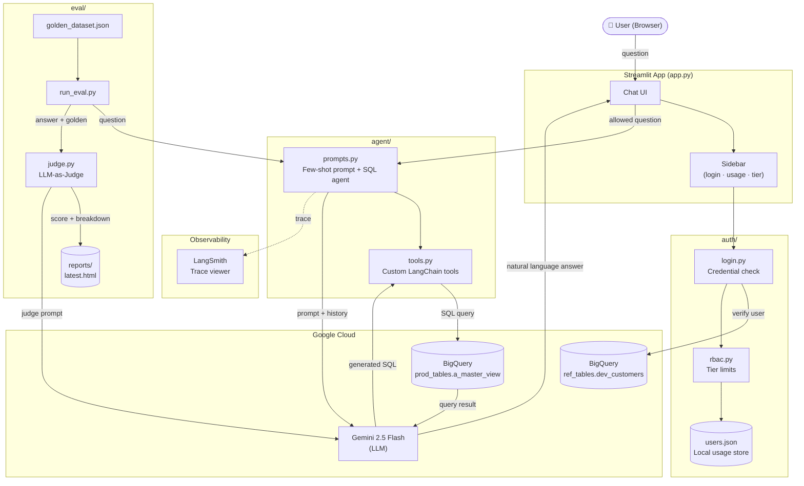

# Demography Insights — Suburb Finder AI

A Streamlit-based SaaS app that lets authenticated users query Australian demographic data using natural language. Questions are answered by a LangChain SQL agent backed by Google Gemini and Google BigQuery.

---

## Problem Statement

### The Problem

Australia holds rich suburb-level demographic data — prosperity scores, diversity indices, rental affordability, education attainment, family composition, and more — yet this data is largely inaccessible to the people who need it most. Real estate investors, property developers, urban planners, and community researchers face a fundamental barrier: **the data lives in SQL databases that require technical expertise to query**.

Today, a property investor who wants to answer "Which suburbs in Queensland have high rental affordability and strong long-term resident stability?" must either:

1. Write complex SQL across multiple columns and aggregations — a skill most domain experts do not have, or
2. Commission a data analyst and wait days for a report, or
3. Rely on simplified, pre-packaged reports that cannot answer their specific question.

This creates a **decision latency and access gap** — high-value insights exist in the data but remain locked away from the decision-makers who need them.

### Why This Matters

Suburb-level demographics directly drive multi-million-dollar decisions in real estate investment, urban development policy, and social services planning. A one-suburb difference in a portfolio decision can mean the difference between a strong rental yield and a high-vacancy property. Yet the people making these calls are not SQL engineers — they are domain specialists who think in plain English.

Beyond real estate, demographic data informs:

- **Urban planning** — where to build schools, transport links, and social housing
- **Government policy** — identifying suburbs with concentrated social disadvantage
- **Community organisations** — targeting services to areas with high migration footprint or young family populations

The status quo forces these users into slow, expensive, intermediary-dependent workflows that delay decisions and limit the questions they can even think to ask.

### What Demography Insights Solves

Demography Insights removes the SQL barrier entirely. Users type a question in plain English — "Show me the top 5 most diverse suburbs in Victoria with above-average resident stability" — and get an answer in seconds, complete with a data table and interactive chart.

The system translates natural language into precise BigQuery SQL via a Google Gemini-powered LangChain agent, executes it against authoritative Australian demographic data (SA2 suburb level, 10 KPIs), and returns a formatted, visualised response. Conversation memory means users can ask follow-up questions naturally, just as they would with a human analyst.

By pairing **LLM-powered query understanding** with **trusted data execution** and a **rigorous evaluation framework** (LLM-as-Judge scoring against a golden dataset), the product delivers analyst-grade answers at conversational speed — democratising access to demographic intelligence for the professionals who need it.

---

## Project Structure

```
demography-insights/
├── app.py                    # Main Streamlit entry point
│
├── agent/
│   ├── bigquery_client.py    # Authenticated BigQuery client for agent queries
│   ├── explore_data.py       # Data exploration utilities
│   ├── prompts.py            # Few-shot prompt prefix + LangChain SQL agent setup
│   ├── sql_agent.py          # (reserved)
│   └── tools.py              # Custom LangChain tools
│
├── auth/
│   ├── bigquery_auth.py      # Verifies users against BigQuery customer table
│   ├── login.py              # Streamlit sidebar login UI
│   ├── rbac.py               # Tier-based query limits (free / basic / pr)
│   └── users.py              # Local usage tracking (read/write users.json)
│
├── db/
│   └── bigquery_client.py    # Shared BigQuery client for auth queries
│
├── chat_history/             # Per-user conversation history (JSON files)
│
├── eval/
│   ├── golden_dataset.json   # Ground-truth Q&A pairs (10 integration + 8 unit test cases)
│   ├── judge.py              # LLM-as-judge: scores answers via Gemini on a 1–5 rubric
│   ├── run_eval.py           # Eval runner + pytest unit tests
│   └── reports/              # Generated HTML + JSON reports (latest.html always up to date)
│
├── .streamlit/
│   └── config.toml           # Streamlit theme and server config
│
├── users.json                # Runtime usage store (created automatically)
├── .env                      # Environment variables — not committed
├── service_account.json      # GCP service account key — not committed
└── requirements.txt          # Python dependencies
```

---

## Architecture



---

## How It Works — Step by Step

This section traces a single user question from the browser all the way to the rendered answer, naming the exact file and function responsible at each step.

---

### Step 1 — User types a question (`app.py`)

The Streamlit chat input widget in `app.py` captures the question:

```python
# app.py  ~line 383
prompt = st.chat_input("Ask your question...")
final_prompt = prompt or st.session_state.clicked_query
```

If the user typed something, `final_prompt` holds it. If they clicked a demo query button in the sidebar, `st.session_state.clicked_query` holds it instead. Both paths converge on the same string.

Before the question goes anywhere, the RBAC check (`auth/rbac.py`) confirms the user still has quota. If `remaining == 0` the chat input is replaced with a locked banner and `st.stop()` is never reached. If quota is available, execution continues.

---

### Step 2 — Chat history is loaded and the question is dispatched (`app.py` → `agent/memory.py`)

```python
# app.py  ~line 396
response = ask_question_with_memory(user, final_prompt, chat_history)
```

`ask_question_with_memory` lives in `agent/memory.py`. It does two things before touching the LLM:

1. **Seeds in-memory context from disk** — on the first call for a user it reads the persisted `chat_history/*.json` file (loaded by `load_chat()` in `app.py`) and replays the last 5 user/assistant pairs into a `ChatMessageHistory` object.
2. **Builds a context block** — it formats those past exchanges as a plain-text prefix:

```python
# agent/memory.py  ~line 43
def _build_context_block(user_id: str) -> str:
    ...
    lines.append(f"User: {msg.content}")
    lines.append(f"Assistant: {msg.content}")
```

The current question is then prepended with this history block:

```python
# agent/memory.py  ~line 76
enriched_question = (
    f"Previous conversation:\n{context_block}\n\n"
    f"Current question: {question}"
)
```

This enriched string — not the raw question — is what gets sent to the agent.

---

### Step 3 — The LLM and SQL agent are initialised (`agent/prompts.py`)

The agent is a module-level singleton created once and reused. `create_demografy_agent()` in `agent/prompts.py` sets up three things:

**a) BigQuery connection via LangChain**

```python
# agent/prompts.py  ~line 137
db = SQLDatabase.from_uri(
    f"bigquery://{os.getenv('BIGQUERY_PROJECT')}/prod_tables",
    include_tables=["a_master_view"],
)
```

`SQLDatabase` is a LangChain wrapper around SQLAlchemy. It gives the agent a `sql_db_query` tool that knows how to run SQL against BigQuery.

**b) Gemini as the LLM**

```python
# agent/prompts.py  ~line 154
llm = ChatGoogleGenerativeAI(
    model="gemini-2.5-flash-lite",
    google_api_key=os.getenv("GEMINI_API_KEY"),
    temperature=0,
)
```

`temperature=0` makes the model fully deterministic — important for SQL generation where a creative answer is a broken query.

**c) The few-shot system prompt**

```python
# agent/prompts.py  ~line 168
_agent = create_sql_agent(
    llm=llm,
    db=db,
    prefix=FEW_SHOT_PREFIX,
    ...
)
```

`FEW_SHOT_PREFIX` (defined at the top of `prompts.py`) is a detailed system prompt that tells Gemini:
- The exact table name (`demografy.prod_tables.a_master_view`)
- The mapping from plain English terms to column names (`"diversity"` → `kpi_2_val`, `"rental affordability"` → `kpi_7_val`, etc.)
- Hard rules: never run `DELETE`/`UPDATE`/`INSERT`, always use the query checker before executing, never return an answer before executing the query
- Eight worked example Q→SQL pairs that teach the model the expected SQL style

---

### Step 4 — Plain English is converted to SQL (Gemini inside the LangChain agent)

When `agent.invoke({"input": enriched_question})` is called, LangChain's SQL agent enters a **ReAct loop** — it reasons, selects a tool, observes the result, and repeats until it has a final answer.

The sequence of tool calls for a typical question looks like this:

| Agent step | Tool called | What happens |
|---|---|---|
| 1 | *(no tool)* | Gemini reads the few-shot prompt and the question, then writes the SQL query in its reasoning step |
| 2 | `sql_db_query_checker` | The SQL string is sent back to Gemini to check for syntax errors and BigQuery compatibility |
| 3 | `sql_db_query` | The validated SQL is executed against BigQuery via SQLAlchemy; raw rows are returned as a string |
| 4 | *(no tool)* | Gemini reads the raw rows and composes a natural language answer |

The prompt's `MANDATORY EXECUTION STEPS` section enforces this order — without it the agent sometimes stops after the query checker and hallucinates data instead of executing the query.

---

### Step 5 — The SQL query is run against BigQuery (`sql_db_query` tool → BigQuery)

The `sql_db_query` tool is provided automatically by LangChain's `create_sql_agent`. It calls:

```python
db.run(sql_string)  # SQLDatabase wrapper in LangChain
```

Under the hood this goes through:
- **SQLAlchemy** with the `sqlalchemy-bigquery` dialect
- **`google-cloud-bigquery`** client authenticated via the service account key at `GOOGLE_APPLICATION_CREDENTIALS`
- The query hits `demografy.prod_tables.a_master_view` in BigQuery and returns rows as a plain-text string (e.g., `[('Fitzroy', 'Victoria', 0.87), ...]`)

The result is handed back to the agent as the observation for that tool call.

---

### Step 6 — Raw rows are converted back to plain English (Gemini)

The agent's final reasoning step receives the raw row string and formats it into a readable answer. Because `_agent` is a `create_sql_agent` with `agent_type="openai-tools"`, Gemini generates the final answer as a structured markdown response — typically a short summary sentence followed by a markdown table:

```
The top 3 most diverse suburbs in Victoria are:

| Suburb | State | Diversity Index |
|---|---|---|
| Fitzroy | Victoria | 0.87 |
...
```

This string is returned all the way back through `agent.invoke()` → `ask_question_with_memory()` → `app.py` as `response`.

---

### Step 7 — The answer is saved to memory and rendered (`agent/memory.py` → `app.py`)

Back in `agent/memory.py`, the completed exchange is saved to the in-memory store so it becomes available as context for the next question:

```python
# agent/memory.py  ~line 95
history.add_user_message(question)
history.add_ai_message(answer)
```

Back in `app.py`, `render_assistant_message(str(response))` does three things:

1. **Renders the markdown text** with `st.markdown(content)` — the prose summary and any inline formatting
2. **Parses the markdown table** — `parse_response()` scans the text for `| col |` lines, extracts headers and rows, and builds a Pandas DataFrame
3. **Renders a Plotly chart** — if the DataFrame has one numeric column a horizontal bar chart is drawn; if it has two or more numeric columns a grouped bar chart is drawn

Finally, the chat is persisted to disk (`save_chat(user, chat_history)`) and `increment_usage(user)` updates `users.json` so the rate limit counter stays accurate.

---

### Full call chain summary

```
Browser input
  └─ app.py  st.chat_input()
       └─ app.py  ask_question_with_memory()          # quota check + dispatch
            └─ agent/memory.py  seed_memory_from_history()  # load chat_history/*.json
            └─ agent/memory.py  _build_context_block()      # last 5 exchanges → text
            └─ agent/memory.py  agent.invoke()
                 └─ agent/prompts.py  create_demografy_agent()  # singleton: LLM + DB + prompt
                      └─ Gemini  (few-shot prompt → writes SQL)
                      └─ sql_db_query_checker  (Gemini validates SQL)
                      └─ sql_db_query  → BigQuery via SQLAlchemy  (executes SQL, returns rows)
                      └─ Gemini  (rows → natural language + markdown table)
            └─ agent/memory.py  history.add_user_message / add_ai_message  # save to memory
  └─ app.py  render_assistant_message()
       └─ st.markdown()          # prose text
       └─ parse_response()       # markdown table → Pandas DataFrame
       └─ st.plotly_chart()      # DataFrame → interactive bar chart
  └─ app.py  save_chat()         # persist to chat_history/<user>.json
  └─ app.py  increment_usage()   # update users.json rate limit counter
```

---

## Tech Stack

| Layer | Technology |
|---|---|
| Frontend / UI | [Streamlit](https://streamlit.io) |
| LLM | Google Gemini (`gemini-2.5-flash-lite`) via `langchain-google-genai` |
| Agent framework | [LangChain](https://www.langchain.com) SQL agent |
| Data warehouse | [Google BigQuery](https://cloud.google.com/bigquery) |
| BQ connector | `sqlalchemy-bigquery` + `google-cloud-bigquery` |
| Auth backend | BigQuery (`demografy.ref_tables.dev_customers`) |
| Observability | [LangSmith](https://smith.langchain.com) tracing |
| Env management | `python-dotenv` |

**Data source:** `demografy.prod_tables.a_master_view` — Australian suburb-level KPIs including prosperity, diversity, education, rental access, social housing, and more.

---

## How Authentication & Tiers Work

1. Users log in with a **User ID + email** pair that is verified against BigQuery.
2. Each user is assigned a **tier** (`free`, `basic`, or `pr`) stored in BigQuery.
3. Question limits per tier are configured via environment variables:
   - `free` — 3 questions per 24 hours
   - `basic` — 20 questions per 24 hours
   - `pr` — 50 questions per 24 hours (`-1` = unlimited)
4. Usage is tracked locally in `users.json` and resets **24 hours after the last login**.
5. A warning banner appears when the user has consumed 80 %+ of their limit.

---

## Setup

### Prerequisites

- Python 3.11+
- A Google Cloud project with BigQuery enabled
- A GCP service account with BigQuery read access
- A Gemini API key
- A LangSmith API key (optional, for tracing)

### 1. Clone and install dependencies

```bash
git clone <repo-url>
cd demography-insights
pip install -r requirements.txt
```

### 2. Configure environment variables

Create a `.env` file in the project root:

```env
GOOGLE_APPLICATION_CREDENTIALS=./service_account.json
GEMINI_API_KEY=your_gemini_api_key
BIGQUERY_PROJECT=your_gcp_project_id

# LangSmith tracing (optional)
LANGCHAIN_TRACING_V2=true
LANGCHAIN_API_KEY=your_langsmith_api_key
LANGCHAIN_PROJECT=your_project_name

# Tier question limits (-1 = unlimited)
FREE_TIER_LIMIT=5
BASIC_TIER_LIMIT=20
PR_TIER_LIMIT=50
```

### 3. Add the GCP service account key

Place your service account JSON file at the path referenced by `GOOGLE_APPLICATION_CREDENTIALS` (default: `./service_account.json`). This file is gitignored — do not commit it.

### 4. Run the app

```bash
streamlit run app.py
```

The app will be available at `http://localhost:8501`.

---

## Evaluation Suite

### Purpose

The eval suite measures the quality of the LangChain SQL agent's natural-language answers against a curated set of known-correct responses. It catches regressions when the prompt, schema, or model changes, and provides a scored HTML report after every run.

It uses an **LLM-as-Judge** pattern: a separate Gemini model reads the agent's answer alongside the expected golden answer and scores it on a 1–5 rubric, then writes a full breakdown of relevance, groundedness, and completeness.

---

### Scoring Rubric

| Score | Label | Meaning |
|---|---|---|
| 5 | PERFECT | Exact match with correct data |
| 4 | GOOD | Correct data, minor formatting differences |
| 3 | OK | Mostly correct, small discrepancies |
| 2 | POOR | Partially correct, significant errors |
| 1 | FAIL | Wrong answer or failed to execute |

---

### Eval File Structure

```
eval/
├── golden_dataset.json   # Ground-truth Q&A pairs (integration + unit test cases)
├── judge.py              # LLM-as-judge: sends question + golden answer + actual answer to Gemini
├── run_eval.py           # Eval runner (also contains pytest unit tests)
└── reports/
    ├── latest.html       # Always overwritten — open this after every run
    ├── latest.json       # Machine-readable version of latest results
    ├── eval_report_<timestamp>.html   # Permanent history of each run
    └── eval_report_<timestamp>.json
```

#### `golden_dataset.json` — two types of entries

| Field | Present on | Purpose |
|---|---|---|
| `question` | all | The natural-language question asked |
| `golden_answer` | all | The correct reference answer (sourced from real DB output) |
| `simulated_answer` | unit test cases only | A pre-written answer fed to the judge — no agent call needed |
| `expected_score_range` | unit test cases only | `[min, max]` the judge score must fall within |
| `test_label` | unit test cases only | Human-readable description of what the test exercises |

---

### Commands

#### Full integration eval — calls the real agent + judge, generates HTML report

```bash
python -m eval.run_eval
```

This will:
1. Load the 10 base cases from `golden_dataset.json`
2. Run each question through the LangChain SQL agent
3. Send the agent's answer + golden answer to the judge LLM
4. Print a scored breakdown to the terminal
5. Write `eval/reports/latest.html` and a timestamped copy

Open the report:
```bash
open eval/reports/latest.html
```

#### Unit tests — judge only, no agent calls, runs in seconds

```bash
pytest eval/run_eval.py -v
```

These tests use the `simulated_answer` field from `golden_dataset.json` — they skip the SQL agent entirely and only exercise the judge. They assert that:
- High-quality simulated answers score **4 or 5**
- Low-quality simulated answers score **1 or 2**
- Partial simulated answers score **2–4**

This lets you verify the judge is calibrated correctly without making any BigQuery or agent calls.

---

### What the HTML Report Contains

- **Header** — average score, total questions, passed (≥ 4) and failed (≤ 2) counts
- **Score distribution** — colour-coded bar chart across all score bands
- **Per-question table** — question, agent answer preview, score badge, and full judge breakdown (relevance, groundedness, completeness, reasoning)

A timestamped JSON version is also saved alongside the HTML for programmatic use.